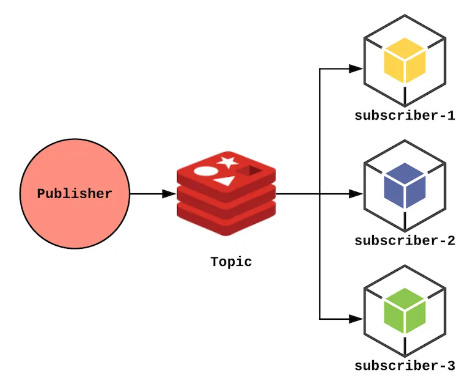

### 싱글톤패턴

- 하나의 클래스에 오직 하나의 인스턴스만 가진다
- 인스턴스가 두개 이상이면 프로그램이 이상하게 돌아간다건가, 자원을 불필요하게 잡아먹음

```java
public class Singleton{
	private static Singleton uniqueInstance = new Singleton();
	private Singleton(){}
	public static Singleton getInstance(){
		return uniqueInstance;
	}

}
```

- 클래스가 로딩될 때 JVM에서 하나뿐인 인스턴스를 생성해준다
- 예시

  - 데이터베이스 연결모듈
  - 스프링 빈의 싱글톤 패턴

    ```java
    import org.springframework.beans.factory.annotation.Autowired;
    import org.springframework.context.ApplicationContext;
    import org.springframework.context.annotation.*;

    @Configuration
    class AppConfig {
        @Bean
        public MyService myService() {
            return new MyService();
        }
    }

    class MyService {}

    public class SingletonCheck {
        public static void main(String[] args) {
            ApplicationContext context = new AnnotationConfigApplicationContext(AppConfig.class);

            MyService service1 = context.getBean(MyService.class);
            MyService service2 = context.getBean(MyService.class);

            System.out.println(service1 == service2);  // true가 출력되면 Singleton
        }
    }

    ```

- **함께 생각해보기**
  - 싱글톤패턴의 단점? 문제?
    - 리플렉션,직렬화,역질렬화

### 팩토리패턴

- new의 문제점
  - new 자체보다는 변화가 문제가 됨
  - 그러나 인터페이스를 사용한다면 변화에 대응할 수 있게 된다
    - 어떤 클래스든 특정 인터페이스만 구현하면 사용할 수 있기 때문 (다형성)
  - 바뀌는 부분을 찾아내서 바뀌지 않는 부분과 분리해야한다!
- Factory
  - 객체 생성을 처리하는 클래스
- 팩토리 메서드는 추상 메서드로 처리해서 서브클래스가 객체 생성을 책임지도록

```java
public abstract class PizzaStore{

	public Pizza orderPizza(String type){
		Pizza pizza;
		pizza = createPizza(type);

		pizza.prepare();
		pizza.bake();
		pizza.cut();
		return pizza;
	}

	protected abstract Pizza createPizza(String type); // Pizza인스턴스 만드는 일은 팩토리 메서드에서
}
```

- React.createElement

```java
const Button = (type:string) => {
  if (type === 'primary') {
    return { color: 'blue', size: 'medium' };
  } else if (type === 'danger') {
    return { color: 'red', size: 'medium' };
  }
}

const myButton = Button('primary'); // 팩토리 함수 사용

const element = React.createElement('button', { className: 'btn' }, 'Click me');
```

- 함께 생각해보기
  - 정적 팩토리 메서드랑 팩토리 패턴의 차이는?
    - 객체 생성 메서드를 실행하려고 객체의 인스턴스를 만들지 않아도 됨
    - 단점 : 서브 클래스를 만들어서 객체 생성 메서드의 행동을 변경할 수 없음

### 옵저버패턴

- 어떤 객체의 상태 변화를 관찰하다가 상태 변화가 있을때마다 메서드 등을 통해 옵저버 목록에 있는 옵저버들에게 변화를 알려줌
- Redis pub sub (예시가 적절하지 않을 수 있음)
  - 어떤 `채팅 방에 속해 있는 유저들에게 어떤 메세지 전송` 또는 `알람 설정을 해놓았던 유저들에게 Push Alarm 보내기`와 같은 상황에서 사용
    
- **함께 생각해보기**
  - 메세지 큐와 차이점?
  - Public-Subscribe 패턴과의 차이점?
    - 출판-구독은 구독자가 서로 다른 유형의 메시지에 관심을 가질 수 있고, 출판사와 구독자를 더 세세하게 분리할 수 있는 복잡한 패턴입니다. 미들웨어 시스템에서 종종 쓰임

### 프록시패턴과 프록시 서버

- 대상 객체에 접근하기 전 그 접근에 대한 흐름을 가로채 대상 객체 앞단의 인터페이스 역할을 하는 디자인 패턴
- 프록시 서버
  - 서버와 클라이언트 사이에서 클라이언트가 자신을 통해 다른 네트워크 서비스에 간접적으로 접속할 수 있게 해주는 컴퓨터 시스템
- **함께 생각해보기**
  - Apache vs Nginx

### 노출모듈 패턴

- 즉시 실행함수를 통해 private,public같은 접근제어자 만드는 패턴
- Cjs
  - 자바스크립트는 전역범위에서 스크립트가 실행됨

```java
// math.js (CommonJS 모듈)
function add(a, b) {
  return a + b;
}

function multiply(a, b) {
  return a * b;
}

// 노출할 것만 명시적으로 반환
module.exports = {
  add,
  multiply,
};

/*
module.exports = {
  공개하고 싶은 함수/변수만 명시
};
*/

```
