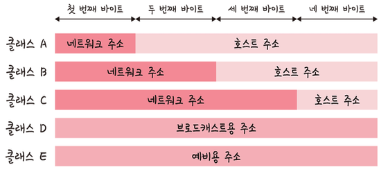
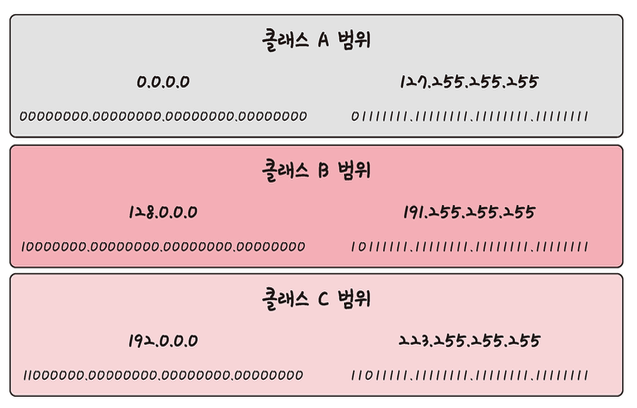

# 2.4 IP 주소

## 2.4.1 ARP

ARP
- IP 주소 -> MAC 주소
- 브로드캐스트 요청 -> 해당 MAC 주소를 가진 장치가 Reply 유니캐스트

RARP
- MAC 주소 -> IP 주소

## 2.4.2 홉바이홉 통신

- IP 주소를 통해 통신하는 과정
- 홉(hop): 통신망에서 각 패킷이 여러 개의 라우터를 건너가는 모습을 비유적으로 표현
- 라우터의 라우팅 테이블 IP 기반으로 패킷을 최종 목적지까지 전달 전달
- 라우팅 테이블의 IP를 통해 여러 라우팅 과정을 거쳐 패킷이 최종 목적지까지 도달

### 라우팅 테이블

- 송신지에서 수신지까지 도달하기 위해 사용
- 라우터에 들어가 있는 목적지 정보들과 그 목적지로 가기 위한 방법이 들어 있는 리스트
- 게이트웨이와 모든 목적지에 대해 해당 목적지에 도달하기 위해 거쳐야 할 다음 라우터 정보를 가지고 있음

### 게이트웨이

- 서로 다른 통신망, 프로토콜을 사용하는 네트워크 간의 통신을 가능하게 하는 관문 역할을 하는 컴퓨터나 소프트웨어
- 서로 다른 네트워크상의 통신 프로토콜을 변환해줌
- 라우팅 테이블을 통해 게이트웨이 확인 가능 (윈도우 `netstat -r` 명령어)

## 2.4.3 IP 주소 체계

| **IPv4** | **IPv6** |
| --- | --- |
| 32비트를 8비트 단위로 점을 찍어 표기 | 64비트를 16비트 단위로 점을 찍어 표기 |
| ex. 123.45.67.89 | ex. 2001:db8::ff00:42:8329 |

### 클래스 기반 할당 방식

- 첫 번째 주소는 네트워크 구별 주소
- 마지막 주소는 브로드캐스트용
- 따라서 사용 가능한 주소는 네트워크 구별 주소와 브로드캐스트용 주소를 제외한 주소만 사용 가능
    - ex. 클래스 A로 12.0.0.0을 부여받았다면
    - 12.0.0.1 ~ 12.255.255.254의 호스트 주소를 부여받은 것
    - 12.0.0.1은 네트워크 구분 주소, 12.255.255.255는 브로드캐스트용 주소이기 때문
- 단점: 사용하는 주소보다 버리는 주소가 많음 (이를 해결하기 위해 DHCP, IPv6, NAT 등장)

### DHCP (Dynamic Host Configuration Protocol)

- IP 주소 및 기타 통신 매개변수를 자동으로 할당하기 위한 네트워크 관리 프로토콜
- IP 주소를 수동으로 설정할 필요 없음. 인터넷 접속 시마다 자동으로 IP 주소 할당

### NAT (Network Address Translation)

- 패킷이 라우팅 장치를 통해 전송되는 동안 패킷의 IP 주소 정보를 수정하여 IP 주소를 다른 주소로 매핑
- 사설 IP ↔︎ 공인 IP 변환에 사용
- IPv4 주소 체계만으로는 많은 주소들을 모두 감당 불가
- NAT로 공인 IP와 사설 IP로 나눠서 많은 주소 처리
- NAT를 가능하게 하는 소프트웨어: ICS, RRAS, Netfilter

#### 공유기와 NAT

- 여러 대의 호스트가 하나의 공인 IP 주소를 사용하여 인터넷 접속
- 하나의 인터넷 회선을 개통하고, 인터넷 고유기를 달아서 여러 PC를 연결하여 사용
- 공유기에 NAT 기능이 탑재되어 있기 때문

#### NAT를 이용한 보안

- 내부 네트워크에서 사용하는 IP 주소와 외부에 드러나는 IP 주소를 다르게 유지 가능

#### NAT의 단점

- 여러 명이 동시에 인터넷을 접속하게 되므로 실제로 접속하는 호스트 숫자에 따라서 접속 속도가 느려질 수 있음

## 2.4.4 IP 주소를 이용한 위치 정보

- [mylocation 사이트](https://mylocation.co.kr) 에서 동 또는 구까지 위치 추적 가능
